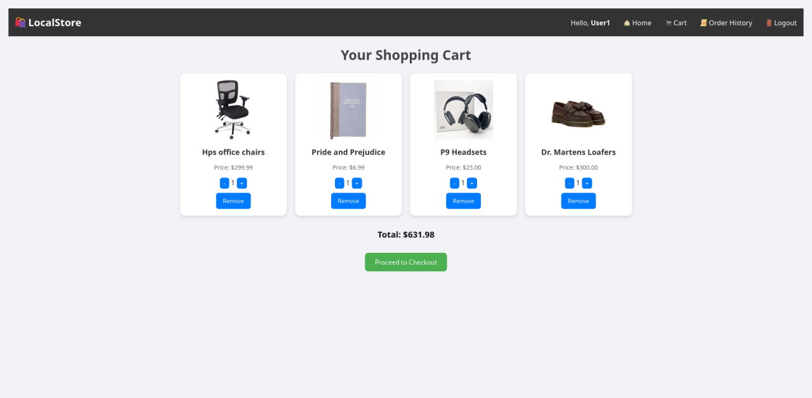
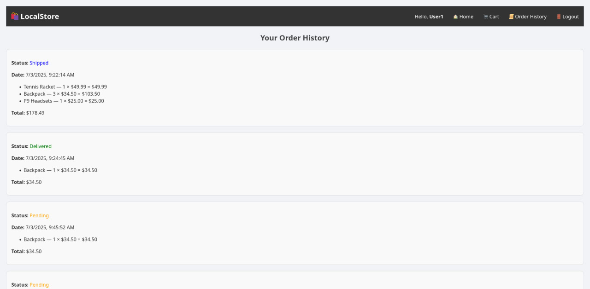
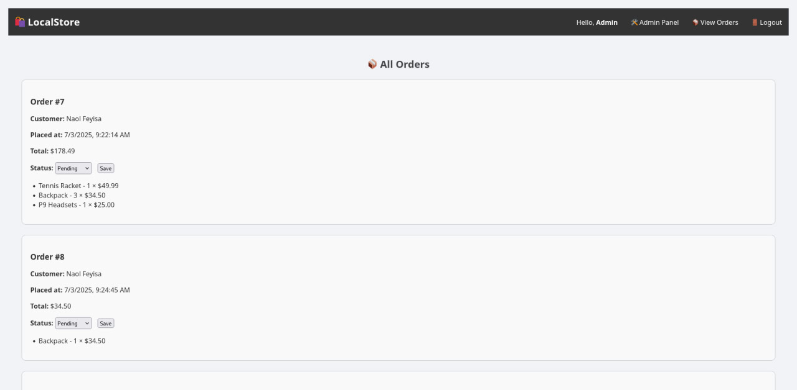

# PRODIGY_FS_03

# 🛒 Local Store – Fullstack E-commerce Web App

**Local Store** is a full-stack e-commerce application built as part of an internship at **Prodigy InfoTech**. This project demonstrates a complete e-commerce workflow including authentication, product browsing, cart functionality, order management, admin dashboard, and more.

## 🚀 Features

### 👤 User Side
- Register, login/logout with JWT-based authentication
- Browse all products by:
  - Category filter
  - Search by name
- Add products to cart
- View and track orders with status updates

### 🛠️ Admin Side
- Add, edit, and delete products
- Upload product images
- Assign products to categories
- View all customer orders and update their status
- Filter and search products by category or name

## 🧱 Tech Stack

### 🔹 Frontend
- HTML5, CSS3, JavaScript

### 🔹 Backend
- Node.js with Express
- Sequelize ORM
- MySQL (or compatible RDBMS)
- JWT for authentication
- Multer for file uploads

## 🗂️ Folder Structure

```

project-root/
├── backend/
│   ├── controllers/
│   ├── models/
│   ├── routes/
│   ├── uploads/
│   ├── server.js
│   └── .env
├── frontend/
│   ├── css/
│   ├── js/
│   ├── index.html
│   ├── login.html
│   ├── register.html
│   ├── admin.html
│   └── ...

````

## ⚙️ Setup Instructions

### 📦 Prerequisites
- Node.js
- MySQL or MariaDB
- Git

### 🔧 Backend Setup

1. Clone the repo:
   ```bash
   git clone https://github.com/naolloan/PRODIGY_FS_03.git
   cd PRODIGY_FS_03/backend
````

2. Install dependencies:

   ```bash
   npm install
   ```

3. Set up `.env`:

   ```env
   DB_HOST=127.0.0.1
   DB_USER=storeuser
   DB_PASSWORD=storepass
   DB_NAME=local_store
   PORT=5000
   ADMIN_CODE=superadmin123
   JWT_SECRET=SuperSecretKey
   ```

4. Run migrations and seed data (if applicable), then start server:

   ```bash
   npm start
   ```

### 🌐 Frontend Setup

Just open `frontend/index.html` in your browser. Make sure the backend server is running at `http://localhost:5000`.

> ⚠️ Note: The app must be run locally — no internet dependencies.

## 🧪 Features Implemented Per Internship Task

✅ **Task 1:** Full-stack e-commerce system with role-based authentication
✅ **Task 2:** JWT Auth, protected routes, admin dashboard
✅ **Task 3:** Product CRUD, image uploads, category filtering
✅ **Task 4:** Order tracking, admin order management, user-side cart + checkout

## 📸 Screenshots

### 🏠 Homepage


### 🛒 Cart View


### 🛒 Order history


### 🛠️ Admin Dashboard


### 🛒 Orders View



## 👨‍💻 Author

**Naol Feyisa**
Intern at Prodigy InfoTech
Project: PRODIGY\_FS\_03
GitHub: [@naolloan](https://github.com/naolloan)

## 📄 License

This project is for educational/demo purposes and is not licensed for commercial use.

